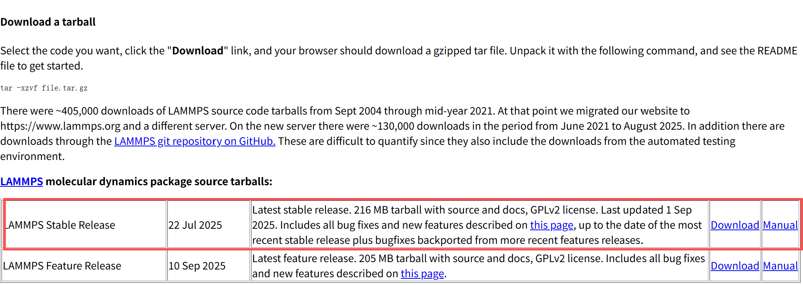
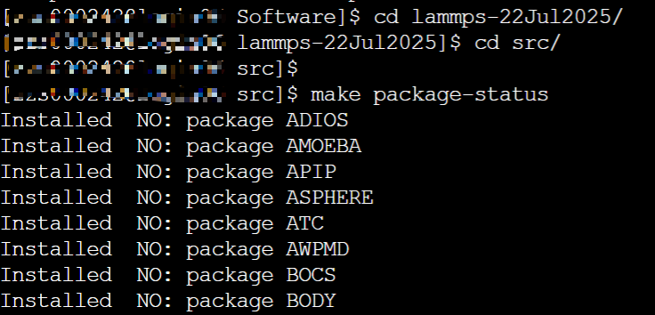
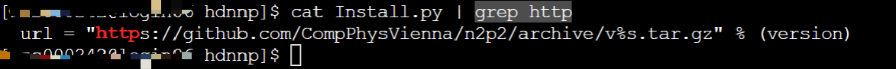
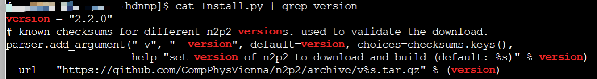
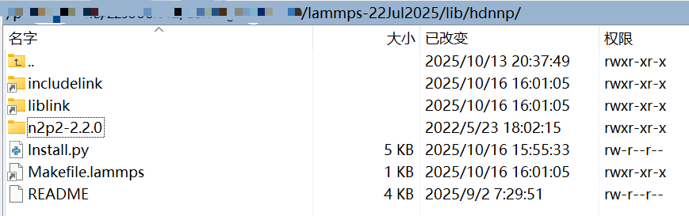
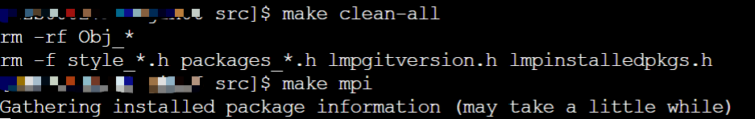

### 1. 安装 LAMMPS

这个安装教程是基于现有超算环境进行安装的，请根据实际情况修改

---

#### 1. 下载LAMMPS安装包

部分超算系统不联网，建议先下载安装包，然后传输到超算上Linux系统中离线安装

· 访问官网下载LAMMPS安装包：https://www.lammps.org/download.html

建议安装最新的稳定版本：



传输到Linux系统中离线安装

#### 2. 解压LAMMPS安装包

“lammps-stable.tar.gz”，存放 ~/software 路径中。解压压缩包的指令为：

```bash
tar -zxvf lammps-stable.tar.gz
```

运行成功后，解压后的文件结构如下：


#### 3. 安装LAMMPS

查看依赖包状态:

```bash
cd lammps-22Jul2025/src/
make package-status
```



各个模块均为 NO 的状态，要安装其中模块，需要将其设置为 YES：

```bash
make yes-MANYBODY
make yes-KSPACE
make yes-MOLECULE
make yes-MISC
```

添加机器学习势函数模块，[pace](https://docs.lammps.org/pair_pace.html)
添加其他包同理

```bash
make yes-ML-PACE
```

检查是否添加设置成功

```bash
make package-status | grep YES
```


#### 4. 编译LAMMPS

编译并行计算版本的可执行程序

```bash
make mpi
```

如果报错，可能是系统缺少依赖包，请安装依赖包，并重新编译

比如**缺乏MPI依赖包**，报错:

```css
make[1]: mpicxx: Command not found
```

解决方法：
检查 MPI 模块

```bash
module avail mpi
```

加载 MPI 模块, 例如，如果你用 OpenMPI：

```bash
module load openmpi/4.1.4
```

加载后检查：

```bash
which mpicxx
```

---

### 2. MLP势函数安装

很有意思的是，LAMMPS的机器学习势函数都提供了联网安装版本，但是大部分超算集群不联网，需要我们自己下载好

可以进入到LAMMPS的安装目录下，进入到`lib/`目录下，找到对应势函数目录，一般有个`Install.py`文件，可以读这个文件，根据代码含义自己安装

### 2.1 安装 NNP 势函数
N2P2网址：
https://compphysvienna.github.io/n2p2/interfaces/if_lammps.html

##### 1. 官网标准步骤

```bash
cd /path/to/lammps/src

# Enable ML-HDNNP package:
make yes-ml-hdnnp

# Automatically download and build n2p2:
make lib-hdnnp args="-b"
# Alternatively, use existing n2p2 installation:
# (follow instructions in <path-to-lammps>/lib/hdnnp/README)
# make lib-hdnnp args="-p path/to/n2p2

# Build LAMMPS for desired target, for example:
make mpi -j
```

**注意：** 这个需要超算联网，可惜大部分超算不联网，需要我们自己下载好

##### 2. 自行下载

进入`lib/`目录下，找到`hdnnp`目录，进入目录，找到`Install.py`文件

```bash
cd /path/to/lammps/src/lib/hdnnp
cat Install.py
```

可以通过找到下载链接直接本地下载

```bash
cat Install.py | grep "http"
```



这里的v%s是版本号，可以通过命令行查看推荐版本号

```bash
cat Install.py | grep version
```



可以看到版本号是2.2.0

这样下载链接为：

https://github.com/CompPhysVienna/n2p2/archive/v2.2.0.tar.gz

在浏览器下载压缩包，将下载好的文件通过Winscp移动到到LAMMPS的lib/hdnnp目录下：


LAMMPS的lib/hdnnp目录为：


##### 3. 安装编译

需要注释掉`Install.py`文件中的下载指令，在90行左右：


执行编译命令, 在lammps/lib/hdnnp目录下

```bash
python Install.py -b
```

运行结果如下:



回到LAMMPS的src目录下，执行编译命令

```bash
make yes-ML-HDNNP
make package-status | grep YES
```


完全清理之前的编译，再编译

```bash
make clean-all
make mpi
```



编译成功！！

