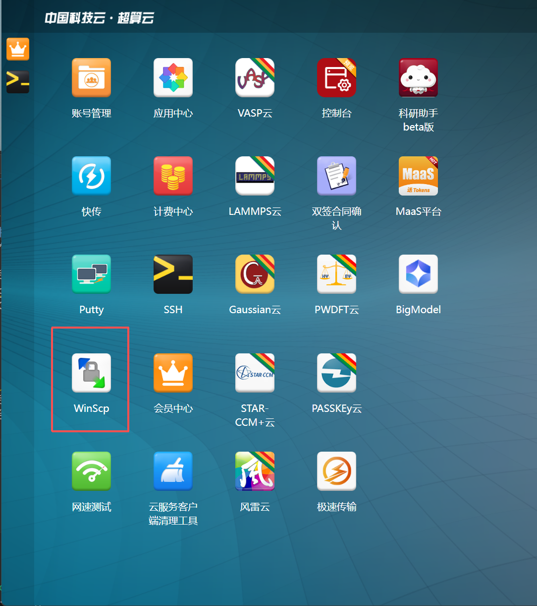
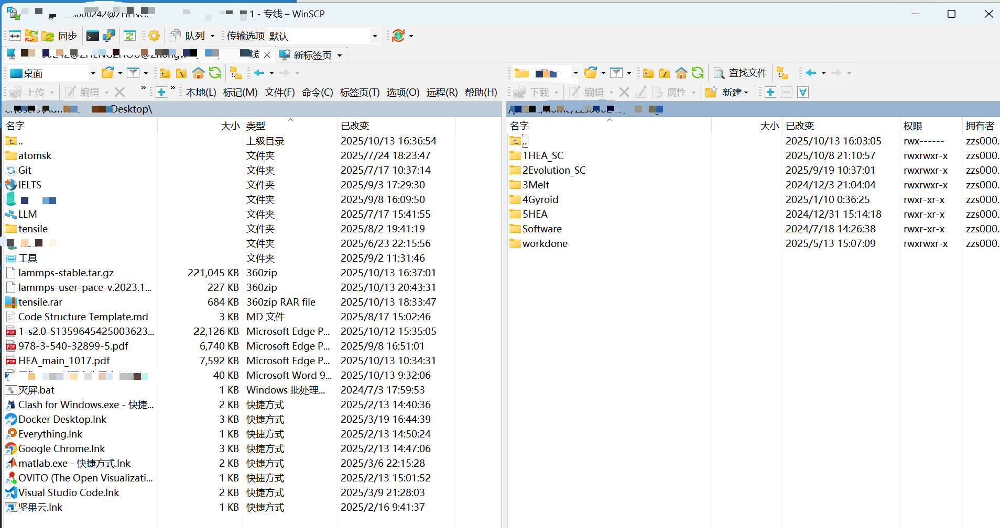
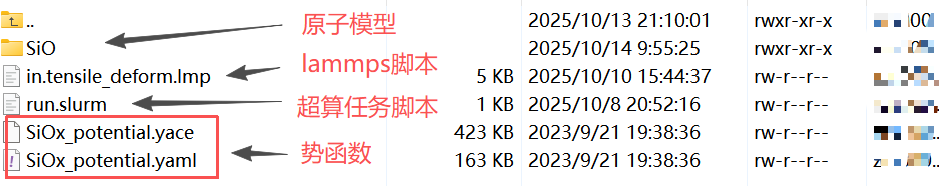
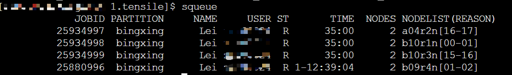

### 2. 提交任务 

这个教程是基于北京超级云，其他超算系统请根据实际情况修改，需提前安装：

北京超算云计算中心 https://cloud.blsc.cn/downloads.html
WinSCP https://winscp.net/eng/index.php

---

#### 1. 超算与本地建立链接

登录超算系统，点击WinSCP图标，选择你的计算平台：




建立链接后，可以从电脑本地传输文件到超算系统，也可以从超算系统传输文件到电脑本地



#### 2. 创建自己的文件夹

通过链接好的Winscp，创建自己的文件夹，在自己的文件夹内，进行一系列计算


将你本地的写好的代码（比如lammps文件），以及提交超算任务的脚本文件（run.slurm），上传到超算系统的文件夹中

**一个lammps MD的任务，你至少需要四个文件**：
1. **lammps脚本**：比如in.melting.lmp
2. **对应的势函数文件**：比如CuTa_LJ15_2014.adp.txt
3. **提交超算任务的脚本文件**：比如run.slurm
4. **初始的原子构型**（也可以通过lammps代码直接生成，但是复杂结构的构型大部分需要自己提供）：比如HfNbTaTiZr_Hole.data



#### 3. 提交超算任务

北京超算云点击**ssh**，打开对应超算平台：


通过cd 指令，进入到自己创建的文件夹中：
假如存放在 uesrs/test 文件夹中

```bash
cd users/test
```

通过ls 指令，查看当前文件夹中的文件：

```bash
ls
```


运行超算任务，通过sbatch指令，将任务提交给超算系统：

```bash
sbatch run.slurm
```

通过squeue指令，查看超算任务状态：

```bash
squeue
```


#### 4. run.slurm超算任务提交脚本介绍
```bash 
#!/bin/bash
#SBATCH -J Test          # 任务名
#SBATCH -n 64            # 运行节点数, CPU核数
#SBATCH -p bingxing      # 指定使用的 分区（partition）, 这相当于你要在哪个计算资源池运行
#SBATCH --error=output/%J.err  #错误输出（stderr）写入 .err 文件，并放入outtput目录下
#SBATCH --output=output/%J.out  #标准输出（stdout）写入 .out 文件，并放入outtput目录下

module unload mpi/hpcx/2.11.0/gcc-7.3.1 # 先卸载不兼容的 MPI 版本（2.11.0）
module load mpi/hpcx/2.4.1/gcc-7.3.1    # 加载兼容的 MPI 模块（2.4.1）
module load apps/lammps/29Oct2020/hpcx-2.4.1-gcc-7.3.1 #加载指定版本的 LAMMPS 模块
mpirun lmp_mpi -i in.test.lmp #执行命令：启动 MPI 任务，运行 64 个进程的 LAMMPS 作业，输入脚本为 in.test.lmp
```

