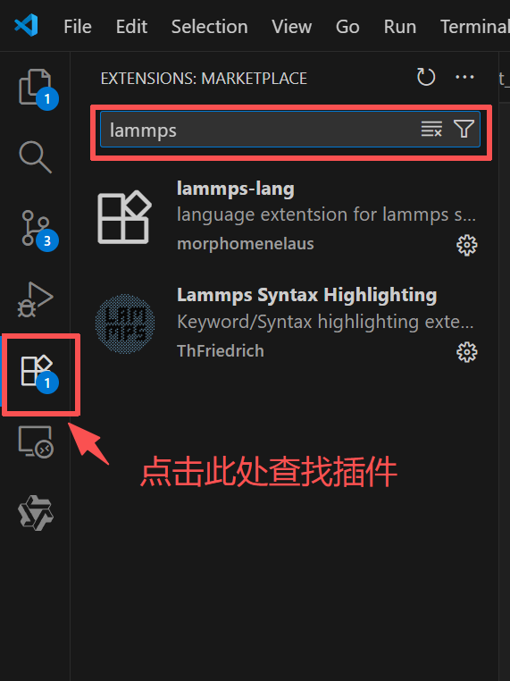
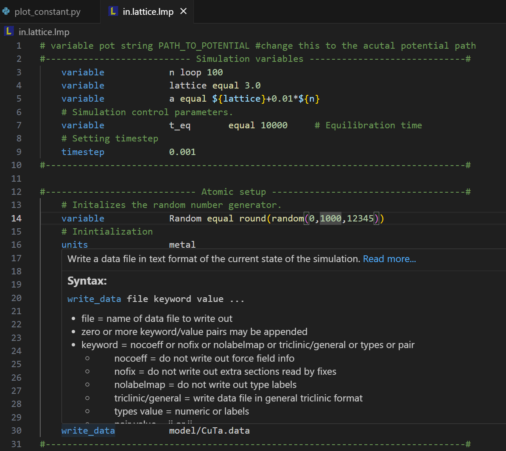
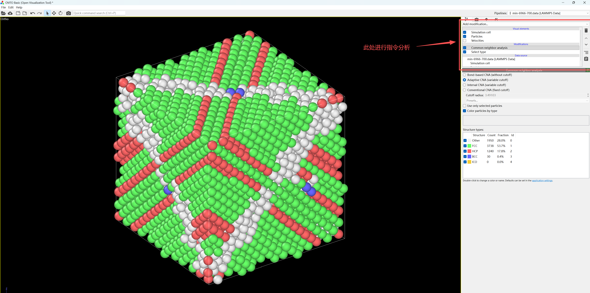
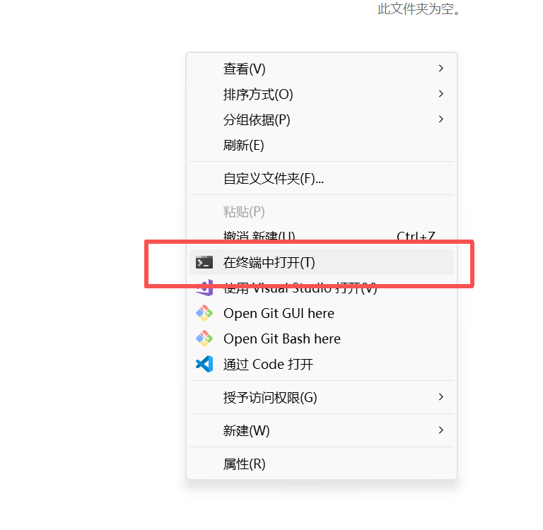

### 4. Lammps的相关软件

推荐两个需要个人电脑安装的软件，个人觉得必须要安装，参考视频为：

https://www.bilibili.com/video/BV1Tv4y1u7uA/?spm_id_from=333.337.search-card.all.click&vd_source=2007af49b1feceefd14281b17c22cf82


#### 1. VSCode 及其相关插件

VSCode 是一个开源的代码编辑器，可以进行代码编写、调试。同时VSCode 还提供了一些插件，可以进行代码格式化、代码提示、代码自动完成等等。是编写代码的利器。作为计算力学，计算物理或者计算材料学的研究生，VSCode 是一个 must-have 工具。

VsCode 安装网址：

https://code.visualstudio.com/

同时支持lammps代码的编写，安装插件：



`lammps-lang` 以及 `Lammps Syntax Highlighting` 建议都安装

插件安装成功后，重启VSCode，就可以开始编写lammps代码了



#### 2. Ovito

Ovito 是一个开源的 molecular visualization software，用于可视化和分析材料

Ovito 安装网址：

https://www.ovito.org/

Ovito 安装成功后，就可以开始可视化了



`ovito` 获得原子结构各种数据，可以进行可视化，进行数据处理，进行数据可视化，进行数据分析等等，非常强大，但是需要多查文档，这里仅做介绍

**注意！！！！**

`ovito` 同时还有一个开源的python package，参考文档为：

https://www.ovito.org/docs/current/python/

可以通过`pip install ovito` 安装，然后使用`import ovito`导入，用以快速的后处理和数据分析

以下为示例代码，通过`ovito` 获得原子结构的各种数据:

```python
from ovito.io import import_file
import numpy as np
from collections import defaultdict
from ovito.modifiers import CoordinationAnalysisModifier, PolyhedralTemplateMatchingModifier
from ovito.data import CutoffNeighborFinder

# ========== Parameters ==========
input_file = "five_fold_2.dump"
cutoff_radius = 3.5

# ========== 1. Load and analyze ==========
pipeline = import_file(input_file)


pipeline.modifiers.append(CoordinationAnalysisModifier(cutoff=cutoff_radius))
ptm = PolyhedralTemplateMatchingModifier()
ptm.output_orientation = True
pipeline.modifiers.append(ptm)
data = pipeline.compute()

# ========== 2. Extract data ==========
positions = data.particles.positions
types = data.particles['Particle Type']
ids = data.particles['Particle Identifier']
coordination = data.particles['Coordination']
structure_type = data.particles['Structure Type']
orientation = data.particles['Orientation']
```

`ovito` python package 有很多妙用，可以结合自己编写的代码突破`ovito` 软件的限制，我以为是研究分析必要掌握的工具

#### 3. Atomsk

Atomsk 是一个开源的原子结构生成工具，可以生成各种原子结构，包括位错，空位，孪晶，多晶等，还可以转换各种原子结构文件格式，有很多妙用。

Atomsk 安装网址：

https://atomsk.univ-lille.fr/

安装好后，直接在window shell 中输入指令即可，可以参考官方的 Document：

https://atomsk.univ-lille.fr/doc.php

入门的话可以直接看官方的Tutorial：

https://atomsk.univ-lille.fr/tutorial_install.php

这里做一个简单示例：

官方示例为：


这里是生成一个晶格常数为 4.02 的 FCC aluminum 晶格结构

我们新建一个空文件夹，右键`在终端中打开`



执行指令

```bash
 atomsk --create fcc 4.02 Al aluminium.xsf
```


可以看到，文件夹中生成了一个名为`aluminium.xsf`的文件，

用`ovito` 直接打开


