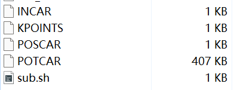

### 5. DFT 入门计算，以 AIMD 为例

这个教程不介绍DFT的基本原理，只是介绍VASP计算所需要的基本文件，和AIMD的关键参数

---

#### 1. VASP计算所需的基本文件

VASP计算所需文件，至少需要四个文件:
`POSCAR`，`INCAR`，`KPOINTS`，`POTCAR`

**INCAR**

- **功能**：主控制文件，设置计算参数
- **内容**：关键词和数值控制计算类型、精度、算法等

```bash
SYSTEM = Si bulk
PREC = Accurate
ISMEAR = 0
SIGMA = 0.05
ENCUT = 520
```

**POSCAR**

- **功能**：晶体结构文件
- **内容**：晶格常数和晶胞矢量，原子坐标，原子种类和数量

说白了，就是一个原子构型，需要把他转化为VASP能识别的POSCAR格式就行，这个使用`OVITO`就能转化

**KPOINTS**

- **功能**：布里渊区取样
- **内容**：k点网格密度或特殊k点路径，取样方法（Monkhorst-Pack、Gamma-centered等）

```bash
Automatic mesh
0
Gamma
4 4 4
0 0 0
```

在计算其他内容时需要调整K的大小以保证体系收敛，但是计算**AIMD**时，由于我们本身就扩胞了构型到100原子左右，因此K点网格密度可以设置为1

**POTCAR**

- **功能**：赝势文件
- **内容**：原子赝势信息
- **注意**：需按POSCAR中（也就是结构中）原子的元素顺序拼接多个元素的POTCAR

```bash
# 拼接多个元素势的Liunx指令
cat POTCAR_Si POTCAR_O > POTCAR
```

可以简单理解为MD中的势函数，需要对应的势函数，才能跑起来

**总结** 相比于分子动力学MD，DFT计算同样需要参数的控制文件（INCAR），需要一个原子构型（POSCAR），和对应构型的势文件（POTCAR）。唯一多了一个布利渊区取样文件（KPOINTS）

---

#### 2. 跑一次VASP在超算上

基于北京超级云，其他超算系统请根据实际情况修改，需提前安装VASP

现在我们的文件夹中有五个文件：



VASP所需的 `POSCAR`，`INCAR`，`KPOINTS`，`POTCAR`
超算提交任务脚本文件 `run.sh`

`run.sh`的代码如下：

```bash
#!/bin/bash
#SBATCH -J VASP
#SBATCH -n 32
#SBATCH -p bingxing
#SBATCH --error=output/%J.err
#SBATCH --output=output/%J.out 

source /public/software//compiler/inteloneapi/setvars.sh
export PATH=/public/home/zzs000242/software-zzs000242/vasp.6.5.1/bin:$PATH

mpirun -np $SLURM_NTASKS vasp_std
```

VASP的好处是就我现在的了解，他的输入文件名必须是`POSCAR`，`INCAR`，`KPOINTS`，`POTCAR`，因此，在提交任务时，也不需要修改`run.sh`，只需要调用VASP的执行文件`vasp_std`即可，会自动识别文件夹中的VASP输入文件开始跑

准备好五个文件，执行Slurm任务提交命令即可:

```bash
sbatch "sub.sh"
```

---

#### 3. VASP计算输出的文件

好了，一切顺利的话，应该已经能跑VASP了，但是，VASP计算之后，会生成很多文件，需要我们自行查看和后处理，这里介绍几个最常用的文件


**CONTCAR**

- **功能**：输出优化后的结构文件
- **内容**：包含计算后最终的晶胞参数和原子坐标，格式与 `POSCAR` 完全一致
- **使用方式**：常直接复制为新的输入结构文件(就是直接改名为`POSCAR`就行)

```bash
cp CONTCAR POSCAR
```

就是跑完一次VASP，新的原子结构文件

**OUTCAR**

- **功能**： 主要详细输出文件，类似与lammps的log文件
- **内容**： 记录完整的计算过程、参数、能量、受力、应力等所有细节信息。用于检查收敛、获取最终结果和调试（分析基本用这个了）
- **常用检索命令**：
```bash
grep "energy without entropy" OUTCAR  # 提取总能
grep "FORCES" OUTCAR                  # 查看原子受力
```

**OSZICAR**

- **功能**：简洁的运行时状态输出
- **内容**：以简明的行格式显示电子和离子每一步的迭代能量、受力变化，方便实时监控计算进度

**vasprun.xml**

- **功能**：标准化的结构输出文件
- **内容**：以 XML 格式存储计算参数、结构、能量、电子结构等数据，便于使用脚本或工具（如 p4vasp, vaspkit）进行后处理分析

---

#### 4. 跑一次AIMD，以 VASP 为例在超算上

现在我们已经对VASP的有了相当粗糙的了解，下面就可以来试试AIMD，就把他当作分子动力学就行

同样我们需要在文件夹准备好，VASP所需的 `POSCAR`，`INCAR`，`KPOINTS`，`POTCAR`
超算提交任务脚本文件 `run.sh`

核心的有3点：

1. `POSCAR` 结构文件，需要扩胞到原子数为100原子左右，各类软件都能做
2. `KPOINTS` 文件，需要设置为 **1**
2. `INCAR` 文件，需要按需求修改分子动力学相关参数

`KPOINTS`的代码如下（不用动，固定就行）：

```bash
K-Points
 0
Gamma
 1  1  1
 0  0  0
```

----

`INCAR`的代码如下 NPT模拟：

```bash
SYSTEM = SiO2 AIMD 1000 K

# Global Parameters
ISTART =  1       # Read existing wavefunction
ISPIN  =  1       # Non-Spin polarised DFT
LWAVE  = .FALSE.  # Write WAVECAR or not
LCHARG = .FALSE.  # Write CHGCAR or not
ADDGRID= .TRUE.
LREAL  = Auto
LASPH  = .TRUE.
PREC   = Normal   # Accurate
ALGO   = Fast

# Electronic Relaxation
ISMEAR = 0
SIGMA  = 0.1
ENCUT  = 500
EDIFF  = 1E-04
EDIFFG = -1E-01

# Molecular Dynamics
IBRION = 0         # Activate MD
ISYM   = 0
SMASS  = 0.0       # Control velocities
MDALGO = 2         # 1 Andersen, 2 Nosé-Hoover
ISIF   = 3         # 2 NVT; 3 NPT
PSTRESS= 20        # PSTRESS=10 -> 1 GPa;
TEBEG  = 1000      # Start temperature K
TEEND  = 1000      # Final temperature K
NSW    = 3000      # total steps
POTIM  = 1         # timestep(fs)
NBLOCK = 1         # output to OUTCAR CONTCAR 
```

`INCAR`参数很多，但是不管，我们只用看一些关于能量，力，温度，系综等关键参数就好，当作写一个简易版本的lammps脚本就可以了

**KEY PARAMETERS:**

##### 1. 电子步收敛参数

**ENCUT**：  `ENCUT=500`
- **功能**：平面波基组的动能截断能
- **重要性**：值越大，计算精度越高，但耗时越长；必须大于所用赝势文件 (POTCAR) 中建议的 ENMAX 值

看成lammps 势函数中设置的cutoff就行

**EDIFF**：  `EDIFF = 1E-04`
- **功能**：电子自洽迭代的收敛标准
- **重要性**：当连续两次电子迭代的总能量变化小于此值时，认为电子结构已收敛，停止电子步迭代

看成lammps 中 做能量最小化设置的能量收敛参数

**EDIFFG**：  `EDIFFG = -1E-01`
- **功能**：离子弛豫（结构优化/分子动力学）的收敛标准
- **重要性**：负值：代表力的收敛标准。当所有原子上的最大力小于此值的绝对值时，停止离子步

看成lammps 中 做能量最小化设置的力收敛参数

##### 2. AIMD动力学参数

**ISIF**：  `ISIF   = 3`
- **功能**：决定在离子弛豫或分子动力学中，哪些自由度被优化
- **重要性**：
  - `ISIF = 2`：只优化原子位置。晶胞的形状和体积固定。类似 NVT 系综的几何优化
  - `ISIF = 3`：优化原子位置和晶胞形状。类似 NPT 系综的几何优化

**PSTRESS**：  `PSTRESS = 20`
- **功能**：在可变晶胞的计算中（`ISIF=3`），施加一个目标外部压强
- **单位**：**kBar**
- **换算**： `1 GPa = 10 kBar`

**TEBEG&TEEND**：  `TEBEG = 1000 & TEEND = 1000`
- **功能**：设定模拟的起始和结束温度
- **单位**：**K**
- **含义**：
    - `TEBEG = 1000`：模拟从 1000 K 开始
    - `TEEND = 1000`：模拟在 1000 K 结束
    - 两者相等，表示进行 **恒温** 分子动力学模拟
    - 如果 TEEND 不同，则模拟过程中温度会线性变化（升温或退火）

**NSW**：`NSW = 3000`
- **功能**：设定离子运动的总步数
- **含义**：这里 3000 表示将进行 3000 步 的分子动力学模拟。总模拟物理时间 = ``NSW * POTIM``

**POTIM**：`POTIM = 1`
- **功能**：离子运动的时间步长
- **单位**：飞秒 (fs, $10^{-15}$ s)
- **重要性**：
  - 步长太大会导致能量不守恒甚至模拟崩溃
  - 对于含轻元素（如 H）或高温体系，通常需要更小的步长（如 0.5 fs）
  - **总模拟时间** = `NSW * POTIM` = 3000 * 1 fs = 3 ps

----

##### 3. 跑AIMD模拟

设置好INCAR参数后，就可以开始跑AIMD了

**需要：**

1. 运行超算任务脚本文件 `run.sh`
2. 结构文件 `POSCAR`
3. 势函数文件 `POTCAR`
4. `INCAR` 文件
5. `KPOINTS` 文件

**检查：**

1. `INCAR` 文件是否正确
2. `KPOINTS` 文件 KPOINTS 是 **1**
3. `POSCAR` 文件结构是否正确，是否扩胞到**100原子左右**
4. `POTCAR` 势的顺序是否与POSCAR一致
