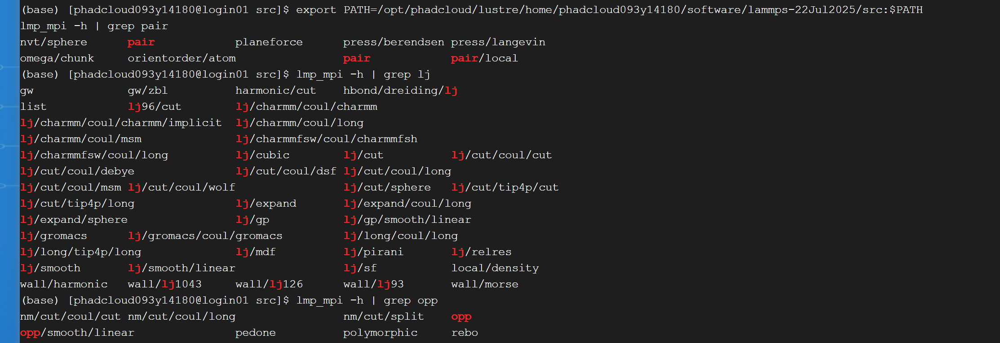

### 6. 安装 LAMMPS 新的势函数

Lammps 本身支持很多势函数，但是部分自己设计和开发的势函数需要自己安装

如何写一个势函数可以参考lammps官方文档：https://docs.lammps.org/Developer_write_pair.html

默认你已经有了新函数的代码：
- `pair_style_file.cpp`
- `pair_style_file.h`

---

有两种不同的安装方式，默认已经安装好了lammps

#### 1. 官方标准安装方式

**版本**：LAMMPS-29Aug2024

**安装步骤**：

1. 将对应的势函数代码复制到`lammps`的`src\EXTRA-PAIR`目录下

将`pair_style_file.cpp`和`pair_style_file.h`复制到`lammps`的`src\EXTRA-PAIR`目录下

2. 进入`lammps`的`src`目录

```bash
cd lammps-29Aug2024/src
```

3. 清理原来的lammps编译

完全清理之前的编译，再编译

```bash
make clean-all
```

4. 编译

先load对应的mpi编译器：

```bash
module purge
module load gcc/9.5.0
module load openmpi/4.1.6
```

接着编译

```bash
make yes-EXTRA-PAIR
make mpi
```

5. 检查是否安装成功

```bash
export PATH=/opt/phadcloud/lustre/home/phadcloud093y14180/software/lammps-22Jul2025/src:$PATH
lmp_mpi -h | grep opp
```

就是查看lmp里面存在对应的势函数名，比如：opp


